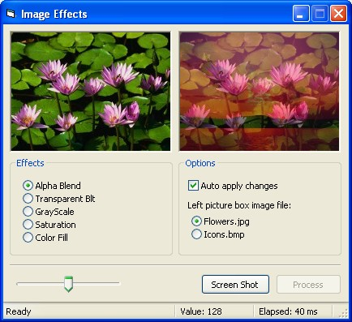



## cImageFX

### Description

Ever wanted to alpha-blend the images in your program? Or to apply Grayscale effects?

With this class you'll be able to do it! This class is fast and the code is self-explanatory so you can add your own effects!

This code uses API and DIB sections, so it's very fast and doesn't have any dependencies at all.
 
### More Info
 

             |
---                |---
**Submitted On**   |2006-07-06 13:55:46
**By**             |[BioHazardMX](https://github.com/Planet-Source-Code/PSCIndex/blob/master/ByAuthor/biohazardmx.md)
**Level**          |Intermediate
**User Rating**    |5.0 (20 globes from 4 users)
**Compatibility**  |VB 6\.0
**Category**       |[Graphics](https://github.com/Planet-Source-Code/PSCIndex/blob/master/ByCategory/graphics__1-46.md)
**World**          |[Visual Basic](https://github.com/Planet-Source-Code/PSCIndex/blob/master/ByWorld/visual-basic.md)
**Archive File**   |[cImageFX200479762006\.zip](https://github.com/Planet-Source-Code/biohazardmx-cimagefx__1-65884/archive/master.zip)

